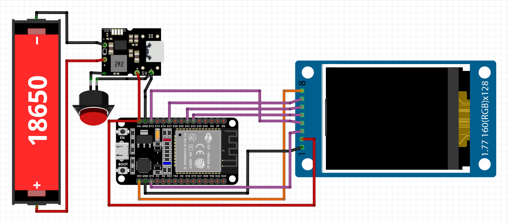

# esp32_PC_monitor

**esp32_PC_monitor** is a complete solution consisting of an ESP32-based device and a PC client to monitor your computer's real-time statistics via Bluetooth.


## 🔌 Hardware (ESP32 Firmware)

The `esp32_PC_monitor.ino` file contains the firmware for the ESP32 controller. It handles Bluetooth communication and drives the display (TFT 1.77") to show your PC stats.

### 📚 Required Libraries

To compile the firmware (`esp32_PC_monitor.ino`), you need to install the following libraries via the **Arduino Library Manager**:

* **BluetoothSerial**: Built-in library for ESP32. Handles the SPP (Serial Port Profile) communication between your PC and the controller.
* **Adafruit ST7735**: Hardware-specific library for the 1.77" TFT display. It manages the low-level data transfer to the screen.

### Wiring Diagram
Below is the connection scheme for the ESP32 and the TFT display.


## 🖥 PC Client (pc_client)

**ESP32 BT Monitor** is a lightweight cross-platform application (Linux & Windows) designed to gather PC stats and send them via Bluetooth. It features a minimalist system tray interface for unobtrusive background operation.

### ⚙️ Key Features
* **Cross-Platform**: Native builds for both Windows and Linux.
* **System Tray Integration**: Runs quietly in the background without cluttering your taskbar.
* **Autostart**: Built-in support to launch automatically on system startup.
* **Automated Builds**: Dedicated scripts for packaging into `.deb` and `.exe` formats.

### 🚀 Installation

#### Windows
1. Go to the [Releases](https://github.com/saintpedr0o/esp32_PC_monitor/releases) page.
2. Download the `ESP32BTMonitor.exe` file.
3. Run the executable.

#### Linux (Debian/Ubuntu)
1. Go to the [Releases](https://github.com/saintpedr0o/esp32_PC_monitor/releases) page.
2. Download the `.deb` package from the latest release.
3. Install it via terminal:

```bash
sudo dpkg -i esp32-bt-monitor-amd64.deb
```

Launch "ESP32 BT Monitor" from your application menu.

### 🛠 Development & Build Instructions
If you wish to build the application from source, ensure you have Go 1.20+ installed.

#### Build Requirements
To compile for all platforms, you will need the following tools:

nfpm: Used for creating Linux .deb packages.

```bash
go install github.com/goreleaser/nfpm/v2/cmd/nfpm@latest
```

rsrc: Required for embedding the icon into the Windows binary.

```bash
go install [github.com/akavel/rsrc@latest](https://github.com/akavel/rsrc@latest)
```

MinGW-w64: Necessary for CGO cross-compilation under Windows.

```bash
sudo apt install mingw-w64
```
#### Compiling
The project includes automation scripts to simplify the build process:

For Linux:

```bash
chmod +x build_linux.sh
./build_linux.sh
```
(Generates a .deb package in the build/ directory)

For Windows:

```bash
chmod +x build_windows.sh
./build_windows.sh
```
(Generates a .exe file in the build/ directory)

### 📂 Project Structure

* **pc_client/main.go**: The entry point of the application. Handles the main loop, Bluetooth communication, and UI orchestration.
* **pc_client/internal/platform/**: Platform-specific Go implementations (system tray logic, autostart, and COM/TTY port discovery).
* **pc_client/build_*.sh**: Automation scripts for cross-compilation and creating installers (Linux `.deb` and Windows `.exe`).
* **pc_client/build/**: Output directory containing compiled binaries and distribution packages.
* **pc_client/nfpm.yaml**: Configuration file, used to generate the Debian package.
* **pc_client/esp32btmonitor.desktop**: Linux desktop entry file to integrate the app into application menus.
* **pc_client/go.mod & go.sum**: Go module files defining project dependencies.
* **pc_client/icon.ico & icon.png**: Application icons. The `.ico` file is multi-layer (16x16 to 256x256) for Windows compatibility, while `.png` is used for Linux.

## 📄 License
This project is licensed under the MIT License. See the LICENSE file for details.

